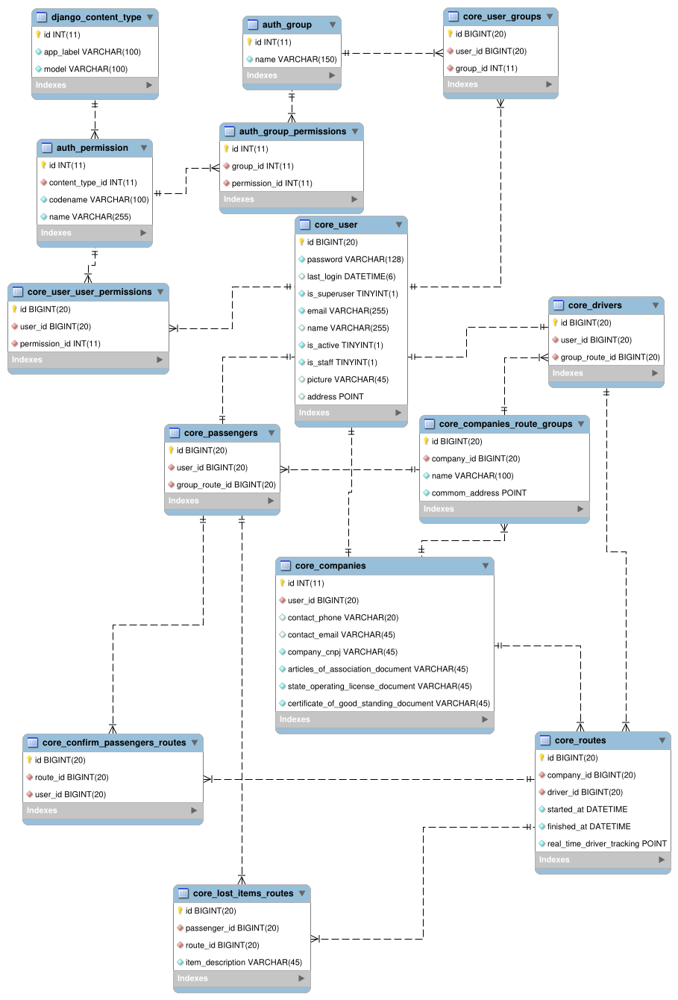
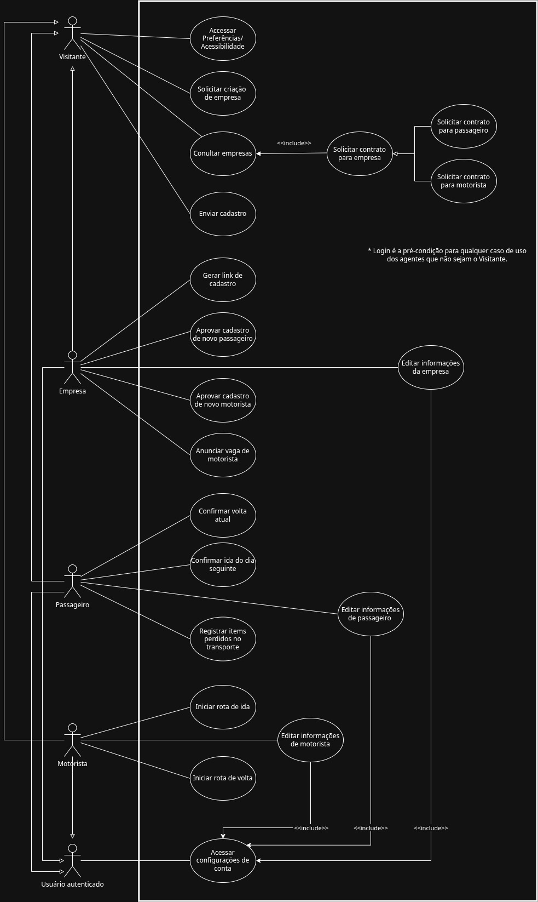

# Projeto Integrador - Modelo
*NextRouter*

Um modelo para o desenvolvimento do Projeto Integrador do Curso de Técnico em Desenvolvimento de Sistemas para a Internet Integrado ao Ensino Médio do IFC - Campus Araquari.
O NextRouter é pensado para a organização e gerenciamento de transportes escolares por todo o Brasil, permitindo que as empresas de transporte se cadastrem e cadastrem seus veículos. Deve organizar rotas e passageiros, além de facilitar a visualização dos passageiros em relação à identificação do veículo e localização do mesmo.

**IMPORTANTE**: [**Cadastre seu projeto nesta planilha**](https://docs.google.com/spreadsheets/d/1bSb1-S9qOf46fNH8quyoFpcjcTuBMj_EdSPchOuFULY/edit?usp=sharing).

Professor: [Marco André Mendes](https://github.com/marrcandre)

Equipe:

- [Gabriela](https://github.com/GabrielaSenderski)
- [Henrique](https://github.com/Henri0042007)
- [Higor](https://github.com/higortab)
- [Ian](https://github.com/IanMV)
- [Maria](https://github.com/mariagtavres)
- [Paulo](https://github.com/Pauloartur-23)

Links do projeto:
(*Coloque aqui os links para a documentação do projeto e os repositórios e plubicação do backend e frontend.*)
-   [Documentação (esse documento)](https://github.com/NextRouter-PI/docs)
-   Backend: [Repositório](https://github.com/NextRouter-PI/Backend-NextRouter) e [Publicação](https://nextrouter.class.fabricadesoftware.ifc.edu.br)
-   Frontend: [Repositório](https://github.com/NextRouter-PI/Frontend-NextRouter) e [Publicação](https://next-router-frontend.vercel.app/)
-   Frontend-Admin: [Repositório](https://github.com/NextRouter-PI/Frontend-Admin)

# 1. Desenvolvimento

**1.1.3 Ordem de Serviço (O.S.)**

**Manutenção de computadores**

Sr. Sálvio, nosso cliente, fez um curso de manutenção de celulares e smartphones e decidiu abrir um negócio no qual ele é responsável pelos consertos e sua esposa, Marília, realiza o atendimento aos clientes. Com sua visão empreendedora, ele sentiu a necessidade de um software que auxilie sua esposa nas tarefas diárias. Para isso, ele deseja um sistema que gerencie os clientes, orçamentos, serviços e retirada dos equipamentos. Sendo um negócio pequeno, é muito importante para ele conseguir ter relatórios que o ajudem na gestão da empresa, como o status dos serviços.

# 2. Situação Problema

A SulTurismo e a IndyTour são dois exemplos de transporte escolar que atuam no trajeto de Joinville até o IFC - Câmpus Araquari, mas de forma muito semelhante à todas as outras corporações de veículos escolares. Essa organização interna pode ser melhorada em diversos quesitos, para o conforto do aluno e praticidade da gestão.

Atualmente, essas empresas fazem seu gerenciamento de forma externa, por exemplo, via whatsapp. Dessa maneira, o contratante precisa, por conta própria, buscar informações sobre quais corporações oferecem o transporte do indivíduo até o destino desejado. Isso faz com que menos pessoas tenham acesso à esse meio de locomoção e por vezes até percam oportunidades pela falta de conhecimento.

Na aplicação do serviço as coisas são feitas de maneira improvisada, utilizando o que tem à disposição. Os responsáveis pelas rotas do dia têm de anotar tudo manualmente em um caderno, os alunos avisam o horário de retorno – se houver – por listas no whatsapp, o motorista do transporte precisa compartilhar sua localização no horário de embarque também pela rede social, etc. Isso faz viável um site que facilite as demandas.

Portanto, é mister que essa organização seja otimizada em um único lugar, e nossa proposta é oferecer uma plataforma web que concentre todas as necessidades das várias personalidades que utilizam desses transportes escolares – gerentes, motoristas e passageiros – de forma à sintetizar cada um dos requerimentos das partes em um lugar só, facilitando o acesso, informação e administração.

# 3. Descrição da proposta

Sistema com foco em gerenciar transportes escolares em geral, permitindo que cada empresa cadastre seus dados. Funcionará oferecendo formas de organização de rotas, veículos e passageiros.

O acesso será dividido entre três usuários, “passageiro”, “motorista” e "empresa”.  A empresa tem acesso ao gerenciamento de todos os veículos, passageiros e motoristas. Os motoristas têm acesso à visualização e alteração da rota do dia. Os passageiros podem visualizar a rota e a geolocalização do motorista.

O software disponibilizará cadastro de empresa e usuário, informações de contato,  informações do veículo, alteração de rotas, gerenciamento de passageiros e motoristas, geolocalização.

# 4. Modelagem de Dados

Descrição das tabelas:

- **core_passengers:** 
- **core_drivers:**
- **core_companies_routes_groups:** 
- **core_companies:**
- **core_lost_items_routes:**
- **core_routes:**
- **core_confirm_passengers_routes:**
- **core_user:**
- **core_user_groups:**
- **auth_group:**
- **auth_group_permissions:**
- **auth_permission:**
- **django_content_type:**
- **core_user_user_permissions:**

# 4. Regras de negócio
(*Nessa parte a equipe deve descrever as regras de negócio que serão implementadas no sistema. O texto abaixo descreve o que essa etapa deve conter e pode ser apagado depois.*)

As **Regras de negócio** são orientações e restrições que ajudam a regular as operações de uma empresa. **Regras** foram criadas para **colaborar com o funcionamento**, seja da sociedade, de uma escola, de um jogo, etc. Não seria diferente nas organizações. Vamos abordar melhor sobre esse assunto. Entender o que são as regras de negócio, sua importância, como são aplicadas e
automatizadas na gestão por processo.

**4.1 O que são regras de negócio?**

Um negócio funciona por processos que, por sua vez, são formados por atividades relacionadas entre si.

As funções das áreas de compras, estoque, logística, finanças, vendas e marketing, por exemplo, compõem um processo de fornecimento de um produto ao cliente.

Dentro desses processos, existem regras que devem ser seguidas durante a execução das atividades, que ajudam a definir **COMO** as operações devem ser realizadas e gerenciadas, **POR QUEM**, **QUANDO**, **ONDE** e **POR QUÊ**.

Podemos dizer que as regras de negócio são **limites impostos às operações**, de forma que elas sigam corretamente em direção às políticas e aos objetivos da instituição.

**4.2 Regras para a criação de regras de negócio**

De maneira geral, as regras de negócio devem:
- Ser **simples**, isto é,  ter apenas uma função.
- Ser **completas**, com início, meio e fim.
- Ser possíveis de **mensurar** e **rastrear**.
- Estar em consonância com a **legislação**.
- Estar **atualizadas** e sempre **revisadas**.
- Refletir a **política** e os **valores** da organização.
- Ser **inteligíveis** para os colaboradores e envolvidos no processo.

**4.3 Por que ter regras de negócio?**

- **Padronização de processos:** padronizam os processos e auxiliam a fluirem de forma mais eficiente e automatizada.
- **Controle de processos:** auxiliam no controle de processos, pois falhas são identificadas e corrigidas mais rapidamente.
- **Tomada de decisão:** auxiliam na tomada de decisão e no cumprimento de estratégias pré-estabelecidas.

**4.4 Exemplos de regras de negócio**

- Em um controle de qualidade de granja, pode-se dizer que a cada 100 ovos impróprios para consumo, o lote será descartado.
- Em um banco, clientes com faturamento mensal de mais de R$ 25 mil e CPF sem restrições, serão atendidos pelo gerente Premium pessoa física.
- Para conclusão de licitações, devem ser feitos três orçamentos e o vencedor será sempre o de menor preço final.
- Em um processo de seleção de RH, o candidato só pode ser aprovado se tiver mais de 5 anos de experiência na área, diploma de pós-graduação, espanhol fluente e pretensão salarial abaixo de R$ 8.000,00.
- Em um processo de vendas, o vendedor só pode vender um produto se o cliente tiver mais de 18 anos, renda familiar acima de R$ 5.000,00 e não tiver restrições no CPF.
- Em um processo de compras, o fornecedor só pode ser contratado se tiver nota fiscal, certificado de qualidade e preço abaixo de R$ 10,00 por unidade.
- Em um processo de logística, o pedido só pode ser enviado se o cliente tiver mais de 18 anos, endereço de entrega no mesmo estado e não tiver restrições no CPF.

**4.5 Como escrever regras de negócio?**

- Número identificador.
- Nome da regra.
- Data de criação e data da última alteração para comparações e
controle.
- Nome dos Autores das versões.
- Número da versão (1, 2 etc).
- Dependências: insira o identificador das regras atreladas, às quais a regra em questão depende.
- Uma descrição detalhada para compreensão da regra.

**4.6 Exemplos de regras de negócio com formatação**

- **RN01 – Criação Comanda:** Para iniciar um atendimento no balcão, é necessário primeiro abrir uma nova comanda.
- **RN02 – Inserir Produtos Comanda:** Para inserir um produto na comanda, é necessário que o produto esteja cadastrado no sistema e que a quantia comprada seja acima de zero.
- **RN03 – Cadastro de Leitores:** Os leitores precisam fazer o cadastro para realizar o empréstimo.
- **RN04 – Realizar Empréstimo:** Para realizar o empréstimo, apenas leitores com cadastro e nenhuma multa em aberto.
- **RN05 – Registro de Empréstimo:** O gerente deve possuir acesso aos registros de empréstimos.
- **RN06 – Pagamento de Multa:** O leitor que passar de 15 dias com o livro deverá pagar a multa de um real por dia de atraso.
- **RN07 – Impressão de Orçamento:** Com as informações do
orçamento registradas, a atendente deve imprimir o orçamento e
repassar ao cliente para aprovação, e caso o cliente aprovar, a atendente deve solicitar a sua assinatura para aprovar a execução do serviço.
- **RN08 – Abertura de OS:** Com o atendimento aprovado pelo cliente, a atendente deverá inserir os dados do cliente e do orçamento em um novo documento, para registros internos, realizando a abertura da OS.
- **RN09 – Relatório de Fluxo de Caixa:** O relatório de fluxo de caixa será permitido somente para o administrador.

# 5. Requisitos funcionais
### Níveis de acesso:
- **Visitante*** - Todo e qualquer usuário que esteja usando o sistema e não esteja autenticado.
- **Passageiro** - O usuário que esteja autenticado como passageiro associado a uma empresa.
- **Motorista** - O usuário que esteja autenticado como motorista associado a uma empresa.
- **Empresa** - O usuário que esteja autenticado como empresa.
Sistema - O sistema acessa essa funcionalidade.

### Entradas:
**R.F 01 - Acessar o Painel de Configurações de Preferências e Acessibilidade:** O sistema deve permitir que o usuário ajuste configurações visuais e de navegação. Este requisito garante a inclusão de usuários com necessidades especiais desde o primeiro contato com a plataforma.
- Dados de entrada: nível de contraste, tamanho da fonte, filtros de daltonismo, altura da linha, redução de movimento.
- Usuários: nível visitante de acesso.

**(Criação: 16:45 20/03/2026; Última modificação: 16:45 20/03/2026; Versão: 1)**

**R.F 02 - Solicitação de Contrato (Motorista/Passageiro):** O sistema deve permitir que o visitante escolha uma empresa específica e solicite um vínculo de contrato como passageiro ou como motorista. Isso formaliza a intenção de adesão ao serviço da empresa selecionada.
- Dados de entrada: tipo de vínculo (passageiro ou motorista), contato de telefone, contato de email, endereço.
- Usuários: nível visitante de acesso.
  
**(Criação: 16:45 20/03/2026; Última modificação: 16:45 20/03/2026; Versão: 1)**

**R.F 03 - Envio de Cadastro (Motorista/Passageiro):** O sistema deve permitir que o visitante preencha e envie seus dados pessoais para registro. Este requisito é o passo final do visitante para se tornar um usuário do sistema, aguardando validação posterior.
- Dados de entrada: nome completo, CPF, e-mail, telefone, endereço.
- Usuários: nível visitante de acesso.

**(Criação: 16:45 20/03/2026; Última modificação: 16:45 20/03/2026; Versão: 1)**

**R.F  04 - Confirmação de Presença em Rotas (Ida/Volta):** O sistema deve permitir que o passageiro confirme sua participação na rota de volta atual e na rota de ida do dia seguinte. Este requisito permite a otimização da logística, garantindo que o motorista não realize paradas em endereços onde não haverá embarque.
- Dados: status de confirmação (confirmado/ausente), identificação da rota.
- Usuários: nível passageiro de acesso.

**(Criação: 16:45 20/03/2026; Última modificação: 16:45 20/03/2026; Versão: 1)**

**R.F 05 - Registro de Itens Perdidos:** O sistema deve oferecer um formulário para que o passageiro relate a perda de objetos no transporte. Este requisito centraliza a comunicação de achados e perdidos, aumentando as chances de recuperação dos itens. 
- Dados: descrição do item, data do ocorrido, turno da rota.
- Usuários: nível passageiro de acesso.

**(Criação: 16:45 20/03/2026; Última modificação: 16:45 20/03/2026; Versão: 1)**

**R.F 06 - Acionamento de Início de Rota:** O sistema deve permitir que o motorista registre o início oficial das rotas de ida e de volta. Esse gatilho é essencial para que o sistema comece o monitoramento e notifique os passageiros que o transporte está a caminho. 
- Dados: ID da rota, horário de início, quilometragem inicial (opcional).
- Usuários: motorista.

**(Criação: 16:45 20/03/2026; Última modificação: 16:45 20/03/2026; Versão: 1)**

**R.F 07 - Edição de Informações de Perfil:** O sistema deve permitir que Empresa, Passageiro e Motorista editem seus dados. Este requisito garante que informações de contato, endereço e perfil estejam sempre atualizadas. 
- Dados: nome, telefone, endereço, documentos.
- Usuários: empresa, passageiro, motorista.

**(Criação: 16:45 20/03/2026; Última modificação: 16:45 20/03/2026; Versão: 1)**

**R.F 08 - Acesso ao Painel de Configurações de Conta:** O sistema deve disponibilizar um painel para gestão de credenciais e segurança. Este requisito é uma pré-condição para a manutenção da conta de qualquer usuário autenticado.
- Dados de entrada: e-mail de login, senha, configurações de privacidade.
- Usuários: níveis de passageiro, motorista e empresa de acesso.

**(Criação: 16:45 20/03/2026; Última modificação: 16:45 20/03/2026; Versão: 1)**

**R.F 09 - Solicitação de Cadastro de Nova Empresa:** O sistema deve permitir que representantes de empresas solicitem sua adesão à plataforma. Este requisito inicia o processo de triagem para que a empresa possa oferecer seus serviços de logística no ecossistema.
- Dados de entrada: nome fantasia, cnpj, email corporativo, telefone de contato, responsável.
- Usuário: nível visitante de acesso.

**(Criação: 16:45 20/03/2026; Última modificação: 16:45 20/03/2026; Versão: 1)**

### Processos:

**R.F 10 - Restaurar Configurações de Preferências e Acessibilidade:** O sistema deve permitir que o visitante possa restaurar configurações de acessibilidade para o padrão em um único clique. Este requisito previne que usuários comprometam sua experiência alterando configurações erradamente.
- Dados de entrada: nível de contraste, tamanho da fonte, filtros de daltonismo, altura da linha, redução de movimento.
- Usuários: nível visitante de acesso.

**(Criação: 16:45 20/03/2026; Última modificação: 16:45 20/03/2026; Versão: 1)**

**R.F 11 - Cálculo de Rotas e Designação de Motoristas:** O sistema deve calcular as rotas tanto de ida quanto de volta, e designar os melhores motoristas para cada rota. Este requisito garante a… 
- Dados de saída: rota, motorista.
- Usuários: níveis de motorista, passageiro, empresa e sistema de acesso.
  
**(Criação: 16:45 20/03/2026; Última modificação: 16:45 20/03/2026; Versão: 1)**

**R.F 12 - Consulta de Empresas:** O sistema deve permitir que o visitante busque por empresas no sistema. Este requisito é fundamental para que interessados em transporte possam verificar quais empresas operam na plataforma.
- Dados de entrada: nome da empresa, localização, filtros de busca.
- Usuários: nível visitante de acesso.

**(Criação: 16:45 20/03/2026; Última modificação: 16:45 20/03/2026; Versão: 1)**

**R.F 13 - Aprovação de Novos Usuários (Motorista/Passageiro):** O sistema deve permitir que a empresa aprove ou rejeite as solicitações de novos integrantes. Este requisito garante a moderação e segurança, permitindo que apenas pessoas autorizadas pela administração da empresa utilizem a logística de transporte.
- Dados de saída: status da aprovação (aprovado/rejeitado), motivo da rejeição (opcional).
- Usuários: nível empresa de acesso.

**(Criação: 16:45 20/03/2026; Última modificação: 16:45 20/03/2026; Versão: 1)**

**R.F 14 - Autenticação de Usuário (Login):** O sistema deve permitir a validação de credenciais de usuário. Este requisito é essencial para o acesso seguro às funcionalidades do sistema de acordo com o tipo de acesso (acesso de passageiro, motorista ou empresa).
- Dados de entrada: email cadastrado, senha da conta.
- Usuário: nível visitante de acesso.

**(Criação: 16:45 20/03/2026; Última modificação: 16:45 20/03/2026; Versão: 1)**

**R.F 15 - Recuperação de Senha:** O sistema deve fornecer um fluxo para que usuários que esqueceram sua senha possam redefini-la. Este requisito é essencial para garantir que o usuário possa ter acesso aos serviços prestados mesmo que tenha esquecido a credencial de senha.
- Dados de entrada: credencial de email da conta a se recuperar, código de verificação enviado por email, nova senha. 
- Usuário: nível visitante de acesso.

**(Criação: 16:45 20/03/2026; Última modificação: 16:45 20/03/2026; Versão: 1)**

**R.F 16 - Finalização de Rota:** O sistema deve permitir que uma rota seja finalizada. É um gatilho essencial para que as rotas não fiquem pendentes no sistema e com isso o relatório da viagem seja feito e o registro de itens perdidos seja enviado.
- Dados de saída: conclusão de rota, relatório de viagem.
- Usuários: nível motorista de acesso.

**(Criação: 16:45 20/03/2026; Última modificação: 16:45 20/03/2026; Versão: 1)**

**R.F 17 - Aprovação de Novas Empresas:** O sistema deve permitir que o administrador valide os dados e documentos de empresas pendentes, autorizando ou negando seu acesso operacional à plataforma. Este processo assegura que apenas entidades jurídicas verificadas possam gerenciar rotas e funcionários. 
- Dados de entrada: status da análise (aprovado/reprovado), justificativa ou observações da decisão, ID da empresa solicitante. 
- Usuários: nível sistema de acesso. 

**(Criação: 16:45 20/03/2026; Última modificação: 16:45 20/03/2026; Versão: 1)**

### Saída:
**R.F 18 - Geração de Link de Cadastro (Motorista/Passageiro):** O sistema deve permitir que a Empresa gere links únicos para convite de novos membros. Isso garante que a empresa tenha controle sobre quem tenta se cadastrar sob seu domínio, servindo como uma primeira camada de segurança e convite oficial.
- Dados de entrada: tipo de perfil vinculado ao link (motorista/passageiro), data de expiração, dados prévios informados pelo visitante durante a solicitação de contrato.
- Usuários: nível empresa de acesso.

**(Criação: 16:45 20/03/2026; Última modificação: 16:45 20/03/2026; Versão: 1)**

**R.F 19 - Anúncio de Vagas de Motorista:** O sistema deve permitir que a empresa publique oportunidades para novos motoristas. Isso facilita a expansão da frota e a captação de prestadores de serviço interessados diretamente na plataforma.
- Dados de entrada: descrição da vaga, requisitos, região de atuação, número de vagas.
- Usuários: nível empresa de acesso.

**(Criação: 16:45 20/03/2026; Última modificação: 16:45 20/03/2026; Versão: 1)**

**R.F  20 - Confirmação de Presença em Rotas (Ida/Volta):** O sistema deve permitir que o passageiro confirme sua participação na rota de volta atual e na rota de ida do dia seguinte. Este requisito permite a otimização da logística, garantindo que o motorista não realize paradas em endereços onde não haverá embarque.
- Dados de entrada: status de confirmação (confirmado/ausente), identificação da rota.
- Usuários: nível passageiro de acesso.

**(Criação: 16:45 20/03/2026; Última modificação: 16:45 20/03/2026; Versão: 1)**

**R.F 21 - Geração de Link de Cadastro para Empresas:** O sistema deve permitir a geração de links únicos para convite de novas empresas. Isso garante o controle sobre quem tenta cadastrar uma nova empresa, servindo como uma camada de segurança a fim de evitar spam.
- Dados de entrada: data de expiração, dados prévios informados pelo visitante durante a solicitação do cadastro.
- Usuários: nível sistema de acesso.

**(Criação: 16:45 20/03/2026; Última modificação: 16:45 20/03/2026; Versão: 1)**

**R.F 22 - Notificação de Proximidade:** O sistema deve disparar alertas automáticos (push) para o passageiro quando o veículo designado estiver a uma distância ou tempo pré-configurado do seu ponto de embarque. Este recurso otimiza o tempo do usuário e evita esperas desnecessárias em via pública. 
- Dados de entrada: coordenadas GPS do veículo em movimento, localização do ponto de embarque do passageiro, raio de distância de alerta (em metros ou minutos).
- Usuários: nível passageiro de acesso .

**(Criação: 16:45 20/03/2026; Última modificação: 16:45 20/03/2026; Versão: 1)**

**R.F 23 - Acompanhamento em Tempo Real (Passageiro):** O sistema deve fornecer uma interface de mapa interativo onde o passageiro possa visualizar a posição atual do veículo durante a execução de uma rota ativa. Isso garante transparência e previsibilidade sobre o andamento do trajeto e horários de chegada. 
- Dados de entrada: sinal de geolocalização do dispositivo do motorista, identificador da rota vinculada. 
- Usuários: nível passageiro de acesso. 
  
**(Criação: 16:45 20/03/2026; Última modificação: 16:45 20/03/2026; Versão: 1)**

**R.F 24 - Visualização de Rota Ativa (Motorista):** O sistema deve exibir ao motorista o trajeto completo a ser percorrido, indicando visualmente os pontos de parada, a sequência de embarque/desembarque e o destino final. O objetivo é auxiliar a navegação e garantir que nenhum ponto de atendimento seja ignorado.
- Dados de entrada: lista de coordenadas dos pontos de parada, mapa cartográfico da região, posição GPS atual. 
- Usuários: nível motorista de acesso. 

**(Criação: 16:45 20/03/2026; Última modificação: 16:45 20/03/2026; Versão: 1)**

# 6. Requisitos não funcionais

Requisitos não funcionais (**RNFs**) são as restrições impostas a um sistema que definem seus atributos de qualidade.

Eles geralmente são indicados por adjetivos como **segurança**, **desempenho** e **escalabilidade**.

**6.1 Categorias de requisitos não funcionais**

Os requisitos não funcionais são importantes porque ajudam a garantir que o sistema atenda às necessidades do usuário.

Os Requisitos Não Funcionais explicam as limitações e restrições do sistema a ser projetado. **Esses requisitos não têm nenhum
impacto na funcionalidade do aplicativo.** Além disso, existe uma prática comum de subclassificar os requisitos não funcionais em várias categorias:

- Interface de Usuário
- Confiabilidade
- Segurança
- Atuação
- Manutenção

Os requisitos não funcionais podem ser divididos em duas categorias:

1. **Atributos de qualidade:** Estas são as características do sistema que determinam sua qualidade geral. Exemplos de atributos de qualidade incluem segurança, desempenho e usabilidade.
2. **Restrições:** Estas são as limitações impostas ao sistema.
Exemplos de restrições incluem tempo, recursos e ambiente.

**6.2 Vantagens dos requisitos não funcionais**

Os requisitos não funcionais ajudam a garantir que o sistema seja:

1. Adaptado às necessidades do usuário.
2. Adequado à finalidade.
3. Escalável, seguro e confiável.
4. Fácil de usar e manter.

**6.3 Exemplos de requisitos não funcionais**

Aqui estão alguns exemplos de requisitos não funcionais:
1. **Segurança**: O sistema deve ser protegido contra acesso não
autorizado.
2. **Atuação**: O sistema deve ser capaz de lidar com o número necessário
de usuários sem qualquer degradação no desempenho.
3. **Escalabilidade**: O sistema deve ser capaz de aumentar ou diminuir
conforme necessário.
4. **Disponibilidade**: O sistema deve estar disponível quando necessário.
5. **Manutenção**: O sistema deve ser fácil de manter e atualizar.
6. **Portabilidade**: O sistema deve ser capaz de rodar em diferentes
plataformas com alterações mínimas.
7. **Confiabilidade**: O sistema deve ser confiável e atender aos requisitos
do usuário.
8. **Usabilidade**: O sistema deve ser fácil de usar e entender.
9. **Compatibilidade**: O sistema deve ser compatível com outros sistemas.
10. **Conformidade**: O sistema deve cumprir todas as leis e regulamentos
aplicáveis.

**6.4 Exemplo de organização dos requisitos não funcionais**

(_A seguir, um exemplo de organização de requisitos não funcionais._)

**Requisitos não funcionais:**

- **R.N.F. 01 - Nome do requisito não funcional:** descrição do requisito.
- **R.N.F. 02 - Nome do requisito não funcional:** descrição do requisito.

**Exemplos de requisitos não funcionais:**

**Sistema de Padaria**:
- **R.N.F. 01 - Navegador homologado:** O sistema deverá ser homologado para os navegadores Google Chrome e Mozilla Firefox.
- **R.N.F. 02 - Processador:** É recomendado para o sistema  no mínimo um processador Intel i3, similar ou superior a geração 7100 ou AMD Ryzen 3 da geração similar ou superior ao 3100, para que o servidor funcione em sua melhor performance.
- **R.N.F. 03 - Memória RAM:** é recomendável que o sistema possua no mínimo 2GB de RAM para melhor performance.
- **R.N.F. 04 - Arquitetura:** Será utilizada a arquitetiura MVC para o desenvolvimento do sistema, com uso de uma API REST para comunicação com o banco de dados.
- **R.N.F. 05 - Banco de dados:** O sistema será implementado com o banco de dados MySQL.
- **R.N.F. 06 - Conexão com banco de dados:** Para conexão com o banco de dados, o sistema utilizará a ferramenta de MySQL Connector.
- **R.N.F. 07 - Implementação:** O sistema deverá ser desenvolvido com linguagem Python, Javascript, HTML5, CSS3 e SQL.
- **R.N.F. 08 - Segurança:** Ficará a critério do responsável do estabelecimento a segurança dos acessos ao sistema, tendo consciência das pessoas que possua permissão para acesso.
- **R.N.F. 09 - Ambiente de Desenvolvimento Integrado (IDE):** Para criação do sistema, será utilizado o editor de texto Visual Studio Code.
- **R.N.F. 10 - Disponibilidade:** O sistema irá atender 99% do tempo de uso, somente ocorreria problemas de cadastro, remoção, inserção ou alteração em casos de falta de rede ou energia.
- **R.N.F. 11 - Legais:** O sistema deve atender às exigências da LGPD (Leis Gerais da Proteção de Dados).

**Sistema de Ordem de Serviço:**
- **R.N.F. 01 - Navegadores homologados:** o sistema deverá ser homologado para os navegadores Google Chrome e Mozilla Firefox.
- **R.N.F. 02 - Tecnologia Front-end:** Para a exibição em front-end, o software utilizará o CSS3 e o HTML5, além do framework Vue.js.
- **R.N.F. 03- Tecnologia Back-end:** O software será desenvolvido pela linguagem de programação Python, com o framework Django e a API REST com Django REST Framework.
- **R.N.F. 04 - Interoperabilidade:** O banco de dados será o MySQL, com a linguagem SQL de banco, sendo todo produzido através do MySQL Workbench .
- **R.N.F. 05 - Forma de uso do software:** O sistema por fazer parte de um ambiente interno, provavelmente será utilizado de acordo com as horas de trabalho da empresa, mas estará ativo 24 horas por dia em 7 dias por semana.
- **R.N.F. 06 - Desempenho:** Para a utilização correta e com uma qualidade e eficiência melhor, é recomendado que se use o SO mais atualizado, com recursos de hardware equivalentes a um processador intel i3 5°Gen ou semelhante, e 8GB de memória RAM, assim como os navegadores homologados.
- **R.N.F. 07- Autenticação:** Para realizar o acesso ao sistema é necessário ter um usuário de autenticação criado pelo administrador, além da possibilidade de solicitar um envio de redefinição de senha.
- **R.N.F. 08 - Web Server:** O servidor web utilizado será o Apache Tomcat, nas versões mais atualizadas.
- **R.N.F. 09 - Níveis de segurança:** O software terá diferentes tipos de acesso para cada tipo de login, tendo as permissões ideais a função de cada um.

**6.6 Conclusão**

Requisitos não funcionais são essenciais para qualquer sistema. Eles ajudam a garantir que o sistema atenda às necessidades do usuário e seja capaz de funcionar como pretendido.

É importante considerar cuidadosamente todos os requisitos não funcionais antes de projetar e desenvolver um sistema.
Eles ajudam a garantir que o sistema atenda às necessidades do usuário e seja capaz de funcionar como pretendido.

# 7. Diagrama de Caso de Uso

Diagrama de interações de atores com o sistema.

---

